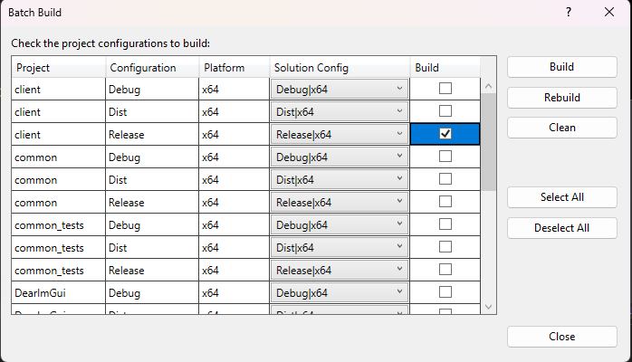
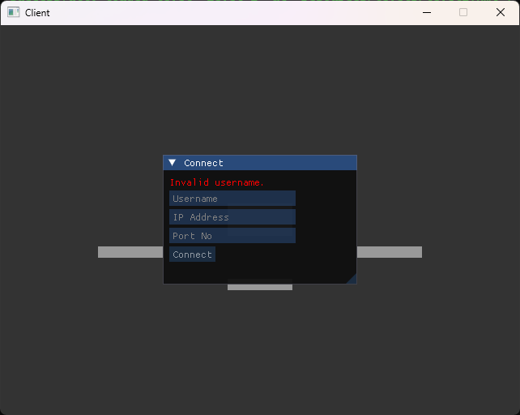
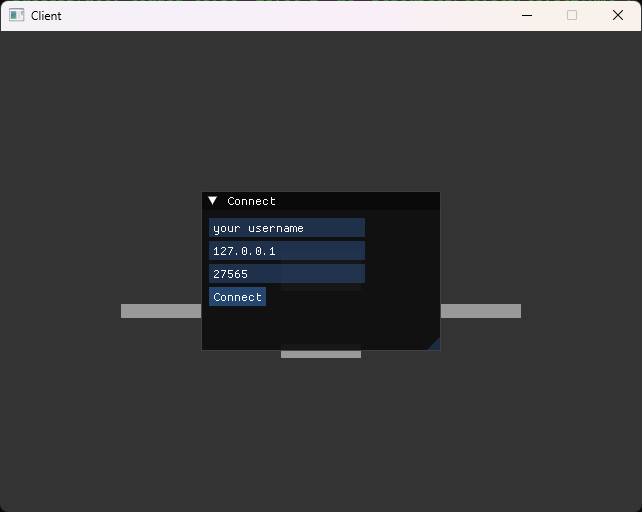

# Final Year Project

## Building
The project uses Premake to provide as a build system to provide configurations for each build target.
Download here: https://premake.github.io/

### Windows
1. Recursively clone the repository and enter the folder.
   ```
   git clone --recursive https://gitlab.cim.rhul.ac.uk/zjac142/PROJECT.git [CLONED NAME]
   cd [CLONED NAME]
   ```
2. Generate project files with Premake. This example assumes you are using Visual Studio 2022, but you can use any of the other generators available with Premake.
    ```
    premake5 vs2022
    ```
3. Open the generated solution file.
4. In Visual Studio, selected Build > Batch Build and select the desired project configurations, then click Build.


### Linux
1. Recursively clone the repository and enter the directory.
```
git clone --recursive https://gitlab.cim.rhul.ac.uk/zjac142/PROJECT.git [CLONED NAME]
cd [CLONED NAME]
```
2. Install the necessary prerequisite libraries to build the project.
```
sudo apt install libx11-dev
sudo apt install libxcursor-dev
sudo apt install libxrandr-dev
sudo apt install libxinerama-dev
sudo apt install libxi-dev
sudo apt install libgl-dev
```
3. Generate the project files with Premake. On Linux, this assumes you are using Make but you are free to use any of the other generators available with Premake.
4. Within the root directory of the project, run `make`. By default this will perform the `make all` command, but to choose another configuration you can run `make config=[CONFIG NAME]`.
5. For more information, run `make help`.

## Running

### Server
When running the server, several optional command line arguments can be used. These can be specifed with the following.

```
./server -port [port number] -tick-rate [tick rate]
```

These arguments are optional and if they are not specified, the server will use its default configuration.

Note: When running the server, ensure that the working directory is set to the directory containing the server executable.

### Client
The client can be run like any executable, either from the command line or via the file explorer. It does not take any additional command line arguments.

## Connecting to the Server
Upon launching the client executable, you will be presented with a connection menu where you can input the necessary details to establish a connection with a server.



For scenarios where you are connecting to a server that is running locally to the client (i.e. on the same machine as the client), you can use the loopback address (`127.0.0.1`) with the port that the server is running on.



## In-Game Controls
While in-game, you can control your player using the following keybindings:
- `A` and `D` - Move your player left and right, respectively.
- `W` - Jump.
- `Mouse` - Aim your weapon.
- `Left Mouse Button` - Fire your weapon.

### Key shortcuts
There are additional shortcuts to access other functionality within the client application:
- `/` - Opens the chat menu, allowing you to type messages. Press `Enter` or the send button to send your message. Close the menu by clicking the `X` button in the corner.
- `Esc` - Opens the screen settings menu.

## Demo
A link to the video demonstrating the project provided: https://www.youtube.com/watch?v=iFP1VEdUTWo